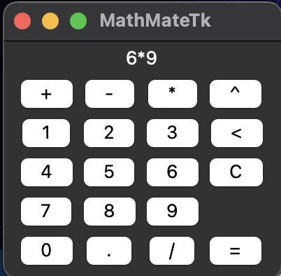

# MathMateTk
MathMateTk is a simple calculator GUI application developed using the Tkinter library in Python. It serves as a practice project for creating a graphical user interface and handling user input.

## Key Features
* Graphical User Interface: MathMateTk provides a user-friendly interface with buttons and labels organised within a window. It demonstrates the design and layout of GUI elements using Tkinter.
* Input Handling: The application captures user input through button clicks. By associating commands with the buttons, MathMateTk can read user interactions and process the input accordingly.
* Basic Mathematical Operations: MathMateTk supports basic mathematical operations such as addition, subtraction, multiplication, division, and exponents. Users can perform calculations by entering numbers and selecting the appropriate operation buttons.
* Exception Handling: There is some exception handling included, but the main focus is on the graphical user interface.

## Usage
To use MathMateTk, you have two options for downloading and running the application.
1. Run with Python Interpreter:
    * Make sure you have Python 3 installed on your system.
    * Clone or download the MathMateTk repository from GitHub.
    * Open a terminal or command prompt and navigate to the downloaded MathMateTk directory.
    * Run the following command to start the application: `python main.py`.
    * The MathMateTk graphical user interface will be displayed, allowing you to start using the application.
2. Download the Release:
    * Visit this repository's release page here on GitHub.
    * Choose the desired release version and download the corresponding executable file for your operating system.
        * Windows: After downloading, double-click the executable file to launch the MathMateTk application. 
        * Mac: Right click on MathMateTk and click "Open" from the menu. 
    * The MathMateTk graphical user interface will be displayed, allowing you to start using the application.

## Dependencies
MathMateTk relies on Python 3 and the Tkinter library, which is a standard GUI toolkit for Python. Ensure that Tkinter is installed before running the application.