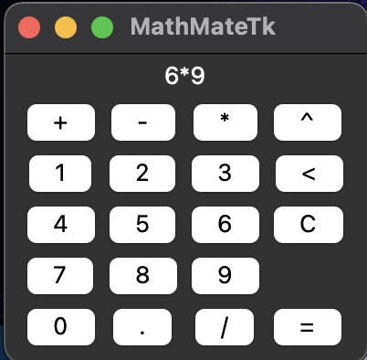

# MathMateTk
MathMateTk is a simple calculator GUI application developed using the Tkinter library in Python. It serves as a practice project for creating a graphical user interface and handling user input.

## Key Features
* Graphical User Interface: MathMateTk provides a user-friendly interface with buttons and labels organised within a window. It demonstrates the design and layout of GUI elements using Tkinter.
* Input Handling: The application captures user input through button clicks. By associating commands with the buttons, MathMateTk can read user interactions and process the input accordingly.
* Basic Mathematical Operations: MathMateTk supports basic mathematical operations such as addition, subtraction, multiplication, division, and exponents. Users can perform calculations by entering numbers and selecting the appropriate operation buttons.
* Exception Handling: There is some exception handling included, but the main focus is on the graphical user interface.

## Usage
To use MathMateTk, simply run the application. The GUI window will appear, displaying buttons for numbers, mathematical operations, and a label for the display. Click on the buttons to enter numbers and perform calculations. The result will be shown in the display label.

## Dependencies
MathMateTk relies on Python 3 and the Tkinter library, which is a standard GUI toolkit for Python. Ensure that Tkinter is installed before running the application.